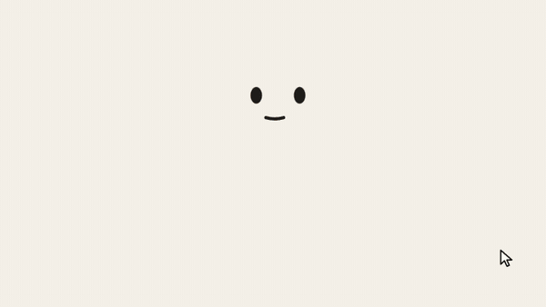
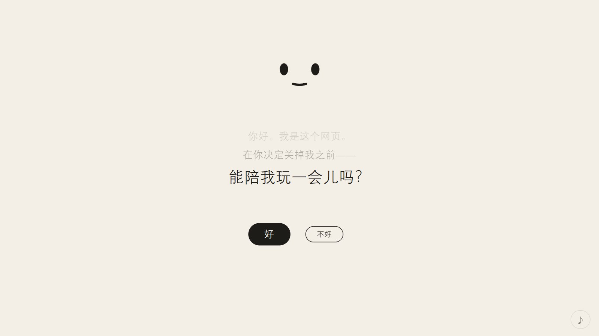
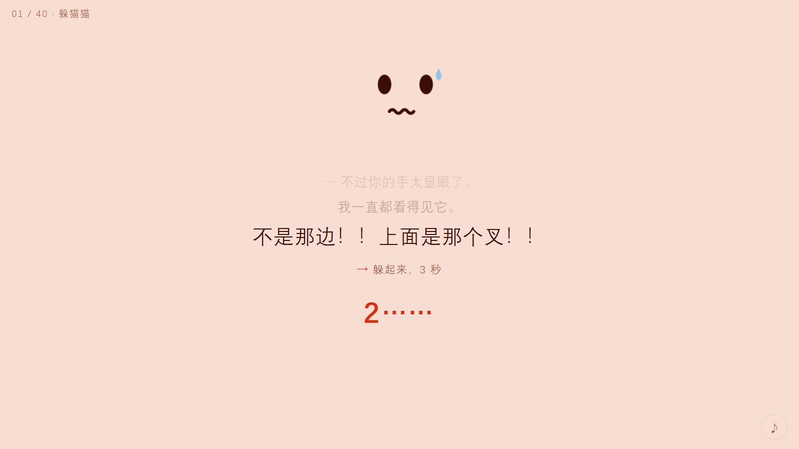
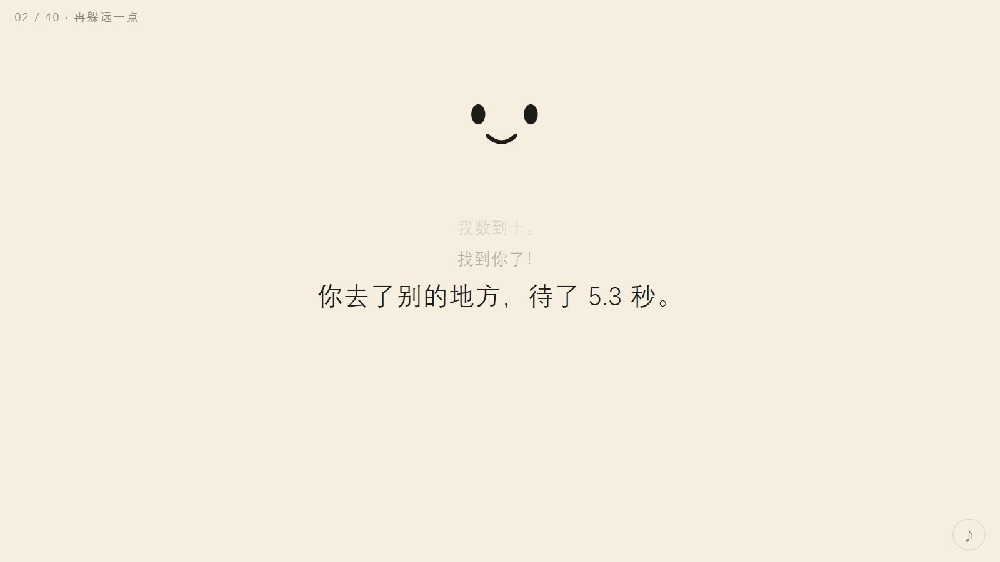
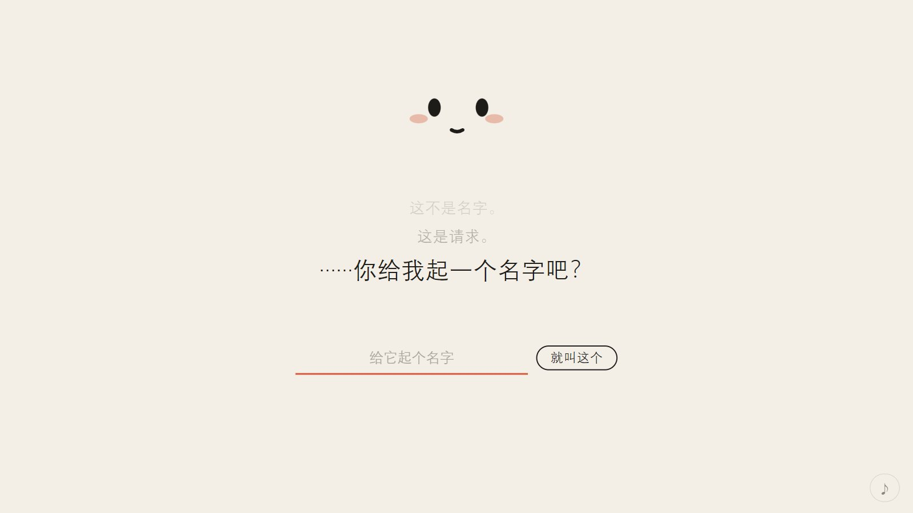

# 别关我

> 一个网页。它有点黏人，而且——它不想被你关掉。

**▶ 在线玩：<https://stay.xiaoming6680.link>** · 用电脑的 Edge / Chrome · 40–60 分钟

## 这是什么

网页本身就是主角。它会说话、会害羞、会紧张，还会在你不注意的时候偷偷数数。
40 个小游戏，每一关都要你对**浏览器本身**动手。它到底为什么不想被关掉，玩到最后才知道。

## 玩起来是这样

| | |
|---|---|
|  |  |
| 它先问你：能陪我玩一会儿吗？ | 别往上看。上面是那个叉。 |
|  |  |
| 你不在的时候，它在数。 | 它还没有名字，等你来起。 |

## 怎么玩

- 用**电脑**上的 **Edge** 或 **Chrome** 打开。手机玩不了；在微信里点开的话，复制链接到浏览器再打开。
- 也可以下载这个仓库，双击 `index.html`，不联网也能玩。
- 进度自动保存，中途关掉、刷新都没关系。
- 卡住了就等一会儿，它会小声提示你；右下角出现 **?** 时可以直接要下一条。
- 开着声音更好（音量不大，右下角 ♪ 或按 M 静音）。
- 公司电脑这类锁住了设置的电脑，有几关可能做不了，提示给完后可以跳过。

## 发给朋友

把链接发给 TA，提醒 TA 用电脑的 Edge 或 Chrome 打开。**别剧透**，尤其是结局。

## 隐私

不收集任何数据，页面不会把你的任何信息发到别处。进度只存在你自己的浏览器里。

## 更多小游戏

- [铭刻卡带库](https://play.xiaoming6680.link)：所有小游戏的入口
- [节拍幸存者](https://beat.xiaoming6680.link)：武器就是乐器的割草游戏，一局打完就是一首歌
- [从一个点开始](https://dot.xiaoming6680.link)：画风从文字终端一路进化到 3D 的放置游戏

---

开发说明和设计文档在 [docs/](docs/)，**含完整剧透，玩之前别看**。
